KDD2009vtreat
================
John Mount

KDD2009 example using the `vtreat` `R` package.

``` r
date()
```

    ## [1] "Sat Apr 13 13:48:44 2019"

``` r
#load some libraries
library('vtreat')
library('WVPlots') 
library('CVRTSEncoder')
library('sigr')
library('parallel')
library("glmnet")
```

    ## Loading required package: Matrix

    ## Loading required package: foreach

    ## Loaded glmnet 2.0-16

``` r
dir = "../../PDSwR2/KDD2009/"


d <- read.table(paste(dir, 'orange_small_train.data.gz', sep = "/"), 
   header = TRUE,
   sep = '\t',
   na.strings = c('NA', '')) 
                                                
churn <- read.table(paste(dir, 'orange_small_train_churn.labels.txt', sep = "/"),
   header = FALSE, sep = '\t')  
d$churn <- churn$V1 

set.seed(729375) 
rgroup <- base::sample(c('train', 'calibrate', 'test'),      
   nrow(d), 
   prob = c(0.8, 0.1, 0.1),
   replace = TRUE)
dTrain <- d[rgroup=='train', , drop = FALSE]
dCal <- d[rgroup=='calibrate', , drop = FALSE]
dTrainAll <- d[rgroup %in% c('train', 'calibrate'), , drop = FALSE]
dTest <- d[rgroup == 'test', , drop = FALSE]
                                                
outcome <- 'churn' 
vars <- setdiff(colnames(dTrainAll), outcome)

                                                
rm(list=c('d', 'churn', 'rgroup'))  

set.seed(239525)

ncore <- parallel::detectCores()
(cl = parallel::makeCluster(ncore))
```

    ## socket cluster with 8 nodes on host 'localhost'

``` r
yName <- "churn"
yTarget <- 1

date()
```

    ## [1] "Sat Apr 13 13:48:53 2019"

``` r
date()
```

    ## [1] "Sat Apr 13 13:48:53 2019"

``` r
# Run other models (with proper coding/training separation).
#
# This gets us back to AUC 0.74 range

customCoders = list('c.PiecewiseV.num' = vtreat::solve_piecewise,
                    'n.PiecewiseV.num' = vtreat::solve_piecewise,
                    'c.knearest.num' = vtreat::square_window,
                    'n.knearest.num' = vtreat::square_window)
cfe = mkCrossFrameCExperiment(dTrain,
                              vars,yName,yTarget,
                              customCoders=customCoders,
                              smFactor=2.0, 
                              parallelCluster=cl)
```

    ## [1] "vtreat 1.4.0 start initial treatment design Sat Apr 13 13:48:53 2019"
    ## [1] " start cross frame work Sat Apr 13 13:51:01 2019"
    ## [1] " vtreat::mkCrossFrameCExperiment done Sat Apr 13 13:52:52 2019"

``` r
treatmentsC = cfe$treatments
scoreFrame = treatmentsC$scoreFrame
table(scoreFrame$code)
```

    ## 
    ##       catB       catP      clean      isBAD   knearest        lev 
    ##         33         33        173        171          3        136 
    ## PiecewiseV 
    ##        166

``` r
selvars <- scoreFrame$varName[scoreFrame$sig<1/nrow(scoreFrame)]
treatedTrainM <- cfe$crossFrame[,c(yName,selvars),drop=FALSE]
treatedTrainM[[yName]] = treatedTrainM[[yName]]==yTarget

treatedTest = prepare(treatmentsC,
                      dTest,
                      pruneSig=NULL, 
                      varRestriction = selvars,
                      parallelCluster=cl)
treatedTest[[yName]] = treatedTest[[yName]]==yTarget

# prepare plotting frames
treatedTrainP = treatedTrainM[, yName, drop=FALSE]
treatedTestP = treatedTest[, yName, drop=FALSE]
date()
```

    ## [1] "Sat Apr 13 13:52:52 2019"

``` r
date()
```

    ## [1] "Sat Apr 13 13:52:52 2019"

``` r
mname = 'glmnet_pred'
print(paste(mname,length(selvars)))
```

    ## [1] "glmnet_pred 345"

``` r
model <- cv.glmnet(as.matrix(treatedTrainM[, selvars, drop = FALSE]),
                   treatedTrainM[[yName]]==yTarget,
                   family = "binomial")
treatedTrainP[[mname]] = as.numeric(predict(
  model, 
  newx = as.matrix(treatedTrainM[, selvars, drop = FALSE]),
  type = 'response',
  s = "lambda.min"))
treatedTestP[[mname]] = as.numeric(predict(
  model,
  newx = as.matrix(treatedTest[, selvars, drop = FALSE]),
  type = 'response',
  s = "lambda.min"))
date()
```

    ## [1] "Sat Apr 13 13:57:43 2019"

``` r
calcAUC(treatedTestP[[mname]], treatedTestP[[yName]]==yTarget)
```

    ## [1] 0.7409803

``` r
permTestAUC(treatedTestP, mname, yName, yTarget = yTarget)
```

    ## [1] "AUC test alt. hyp. AUC>AUC(permuted): (AUC=0.741, s.d.=0.01579, p<1e-05)."

``` r
wrapChiSqTest(treatedTestP, mname, yName, yTarget = yTarget)
```

    ## [1] "Chi-Square Test summary: pseudo-R2=0.09709 (X2(1,N=4975)=258.7, p<1e-05)."

``` r
date()
```

    ## [1] "Sat Apr 13 13:57:43 2019"

``` r
t1 = paste(mname,'trainingM data')
print(DoubleDensityPlot(treatedTrainP, mname, yName, 
                        title=t1))
```

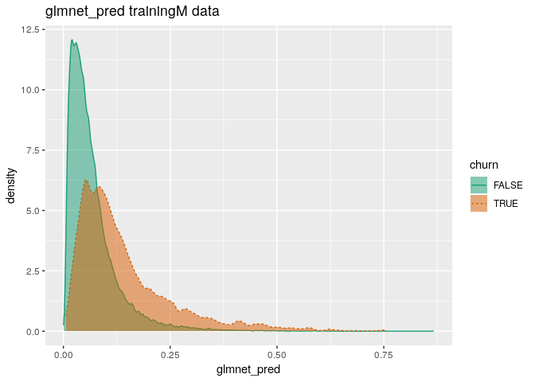

``` r
print(ROCPlot(treatedTrainP, mname, yName, yTarget,
              title=t1))
```

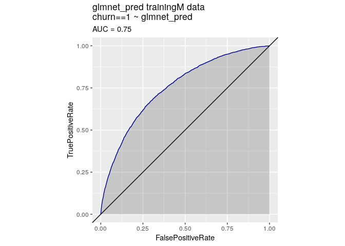

``` r
print(WVPlots::PRPlot(treatedTrainP, mname, yName, yTarget,
              title=t1))
```

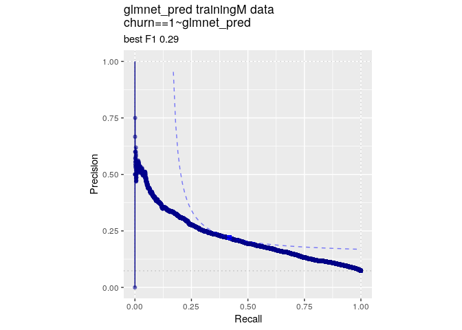

``` r
t2 = paste(mname,'test data')
print(DoubleDensityPlot(treatedTestP, mname, yName, 
                        title=t2))
```

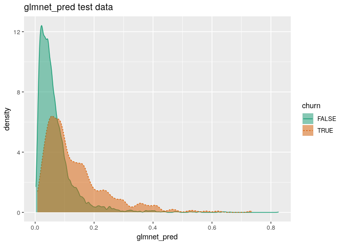

``` r
print(ROCPlot(treatedTestP, mname, yName, yTarget,
              title=t2))
```

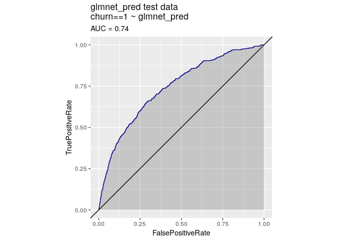

``` r
print(WVPlots::PRPlot(treatedTestP, mname, yName, yTarget,
              title=t2))
```

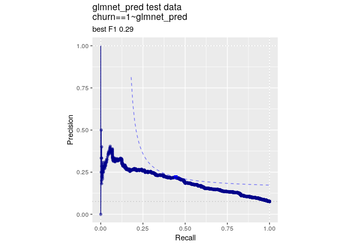

``` r
print(date())
```

    ## [1] "Sat Apr 13 13:57:45 2019"

``` r
print("*****************************")
```

    ## [1] "*****************************"

``` r
date()
```

    ## [1] "Sat Apr 13 13:57:45 2019"

``` r
# enrich with CVRRS encoded variables
date()
```

    ## [1] "Sat Apr 13 13:57:47 2019"

``` r
# encode as in https://github.com/WinVector/CVRTSEncoder
is_cat_var <- vapply(
  vars,
  function(ci) {
    is.character(dTrain[[ci]]) || is.factor(dTrain[[ci]])
  }, logical(1))
categorical_cols <- vars[is_cat_var]
numeric_cols <- vars[!is_cat_var]

cross_enc <- estimate_residual_encoding_c(
  data = dTrain,
  avars = numeric_cols,
  evars = categorical_cols,
  fit_predict = xgboost_fit_predict_c,
  dep_var = yName,
  dep_target = yTarget,
  n_comp = 50,
  cl = cl
)
te_vars <- colnames(cross_enc$cross_frame)
vars <- c(numeric_cols, te_vars)
dTrain <- cbind(dTrain, cross_enc$cross_frame)
dTest <- cbind(dTest,prepare(cross_enc$coder, dTest))

date()
```

    ## [1] "Sat Apr 13 13:59:45 2019"

``` r
date()
```

    ## [1] "Sat Apr 13 13:59:45 2019"

``` r
# Run other models (with proper coding/training separation).
#
# This gets us back to AUC 0.74 range

customCoders = list('c.PiecewiseV.num' = vtreat::solve_piecewise,
                    'n.PiecewiseV.num' = vtreat::solve_piecewise,
                    'c.knearest.num' = vtreat::square_window,
                    'n.knearest.num' = vtreat::square_window)
cfe = mkCrossFrameCExperiment(dTrain,
                              vars,yName,yTarget,
                              customCoders=customCoders,
                              smFactor=2.0, 
                              parallelCluster=cl)
```

    ## [1] "vtreat 1.4.0 start initial treatment design Sat Apr 13 13:59:45 2019"
    ## [1] " start cross frame work Sat Apr 13 14:02:28 2019"
    ## [1] " vtreat::mkCrossFrameCExperiment done Sat Apr 13 14:04:10 2019"

``` r
treatmentsC = cfe$treatments
scoreFrame = treatmentsC$scoreFrame
table(scoreFrame$code)
```

    ## 
    ##      clean      isBAD   knearest PiecewiseV 
    ##        223        171         53        216

``` r
selvars <- scoreFrame$varName[scoreFrame$sig<1/nrow(scoreFrame)]
treatedTrainM <- cfe$crossFrame[,c(yName,selvars),drop=FALSE]
treatedTrainM[[yName]] = treatedTrainM[[yName]]==yTarget

treatedTest = prepare(treatmentsC,
                      dTest,
                      pruneSig=NULL, 
                      varRestriction = selvars,
                      parallelCluster=cl)
treatedTest[[yName]] = treatedTest[[yName]]==yTarget

# prepare plotting frames
treatedTrainP = treatedTrainM[, yName, drop=FALSE]
treatedTestP = treatedTest[, yName, drop=FALSE]
date()
```

    ## [1] "Sat Apr 13 14:04:10 2019"

``` r
date()
```

    ## [1] "Sat Apr 13 14:04:10 2019"

``` r
mname = 'glmnet_pred_CVRTS'
print(paste(mname,length(selvars)))
```

    ## [1] "glmnet_pred_CVRTS 297"

``` r
model <- cv.glmnet(as.matrix(treatedTrainM[, selvars, drop = FALSE]),
                   treatedTrainM[[yName]]==yTarget,
                   family = "binomial")
treatedTrainP[[mname]] = as.numeric(predict(
  model, 
  newx = as.matrix(treatedTrainM[, selvars, drop = FALSE]),
  type = 'response',
  s = "lambda.min"))
treatedTestP[[mname]] = as.numeric(predict(
  model,
  newx = as.matrix(treatedTest[, selvars, drop = FALSE]),
  type = 'response',
  s = "lambda.min"))
date()
```

    ## [1] "Sat Apr 13 14:07:19 2019"

``` r
calcAUC(treatedTestP[[mname]], treatedTestP[[yName]]==yTarget)
```

    ## [1] 0.737085

``` r
permTestAUC(treatedTestP, mname, yName, yTarget = yTarget)
```

    ## [1] "AUC test alt. hyp. AUC>AUC(permuted): (AUC=0.7371, s.d.=0.0141, p<1e-05)."

``` r
wrapChiSqTest(treatedTestP, mname, yName, yTarget = yTarget)
```

    ## [1] "Chi-Square Test summary: pseudo-R2=0.09548 (X2(1,N=4975)=254.5, p<1e-05)."

``` r
date()
```

    ## [1] "Sat Apr 13 14:07:19 2019"

``` r
t1 = paste(mname,'trainingM data')
print(DoubleDensityPlot(treatedTrainP, mname, yName, 
                        title=t1))
```

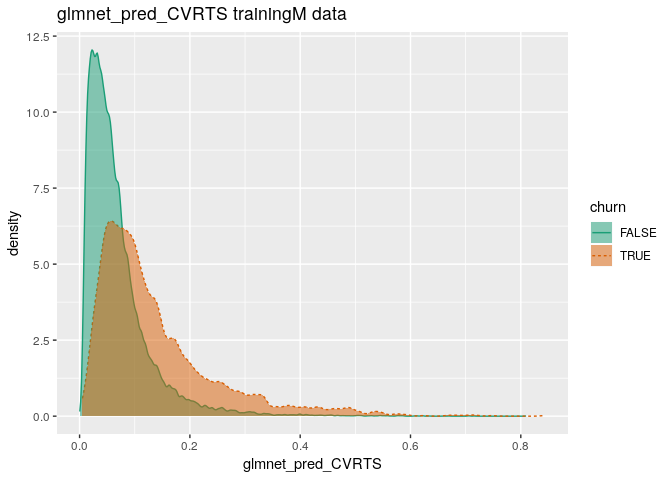

``` r
print(ROCPlot(treatedTrainP, mname, yName, yTarget,
              title=t1))
```

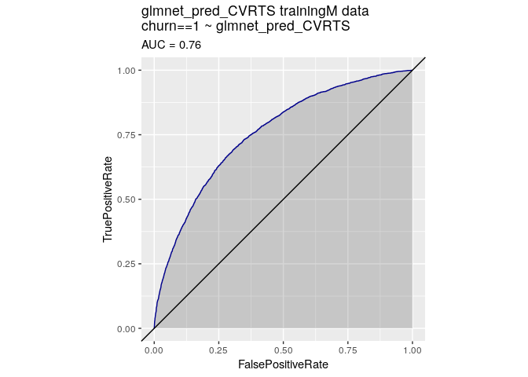

``` r
print(WVPlots::PRPlot(treatedTrainP, mname, yName, yTarget,
              title=t1))
```

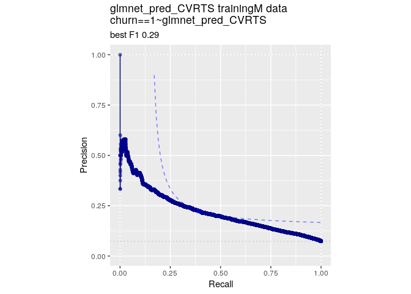

``` r
t2 = paste(mname,'test data')
print(DoubleDensityPlot(treatedTestP, mname, yName, 
                        title=t2))
```

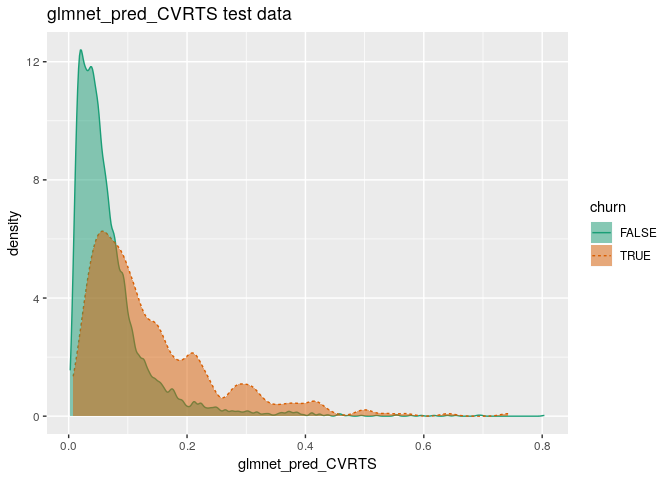

``` r
print(ROCPlot(treatedTestP, mname, yName, yTarget,
              title=t2))
```

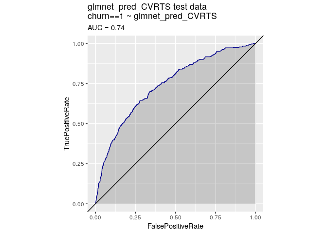

``` r
print(WVPlots::PRPlot(treatedTestP, mname, yName, yTarget,
              title=t2))
```

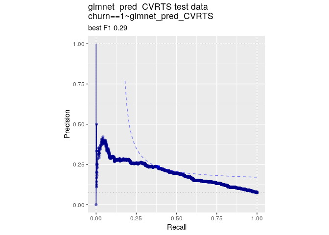

``` r
print(date())
```

    ## [1] "Sat Apr 13 14:07:21 2019"

``` r
print("*****************************")
```

    ## [1] "*****************************"

``` r
date()
```

    ## [1] "Sat Apr 13 14:07:21 2019"

``` r
if(!is.null(cl)) {
    parallel::stopCluster(cl)
    cl = NULL
}
```
