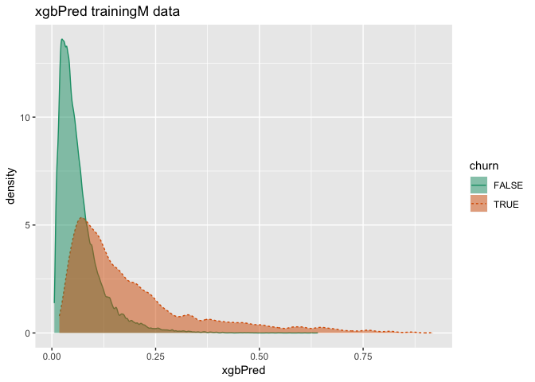
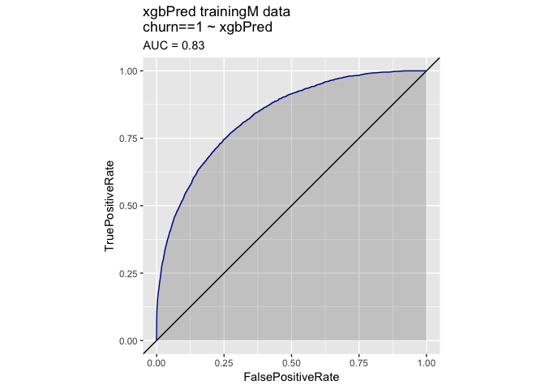
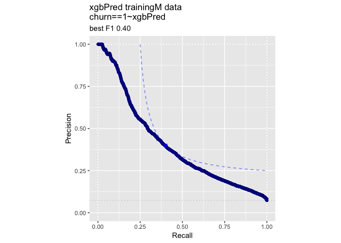
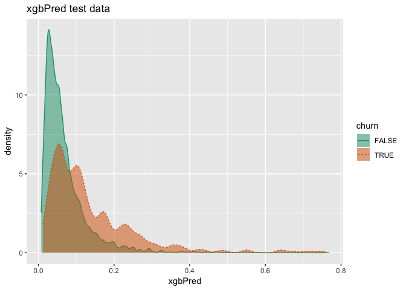
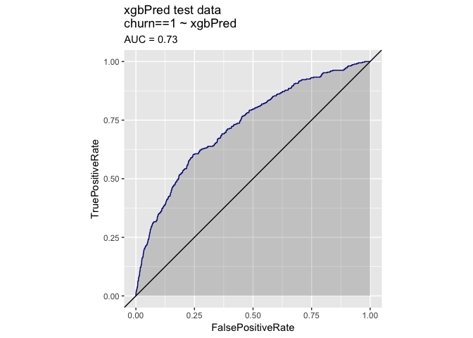
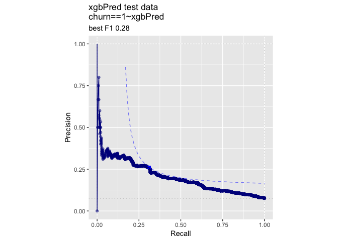

KDD2009vtreat
================
John Mount

KDD2009 example using the `vtreat` `R` package.

``` r
date()
```

    ## [1] "Sat Apr 13 04:56:12 2019"

``` r
#load some libraries
library('vtreat')
library('WVPlots') 
```

    ## Warning: package 'WVPlots' was built under R version 3.5.2

``` r
library('CVRTSEncoder')
library('sigr')
```

    ## Warning: package 'sigr' was built under R version 3.5.2

``` r
library('parallel')
library('xgboost')
```

    ## Warning: package 'xgboost' was built under R version 3.5.2

``` r
dir = "../../PDSwR2/KDD2009/"


d <- read.table(paste(dir, 'orange_small_train.data.gz', sep = "/"), 
   header = TRUE,
   sep = '\t',
   na.strings = c('NA', '')) 
                                                
churn <- read.table(paste(dir, 'orange_small_train_churn.labels.txt', sep = "/"),
   header = FALSE, sep = '\t')  
d$churn <- churn$V1 

set.seed(729375) 
rgroup <- base::sample(c('train', 'calibrate', 'test'),      
   nrow(d), 
   prob = c(0.8, 0.1, 0.1),
   replace = TRUE)
dTrain <- d[rgroup=='train', , drop = FALSE]
dCal <- d[rgroup=='calibrate', , drop = FALSE]
dTrainAll <- d[rgroup %in% c('train', 'calibrate'), , drop = FALSE]
dTest <- d[rgroup == 'test', , drop = FALSE]
                                                
outcome <- 'churn' 
vars <- setdiff(colnames(dTrainAll), outcome)

                                                
rm(list=c('d', 'churn', 'rgroup'))  

set.seed(239525)

ncore <- parallel::detectCores()
(cl = parallel::makeCluster(ncore))
```

    ## socket cluster with 4 nodes on host 'localhost'

``` r
yName <- "churn"
yTarget <- 1

date()
```

    ## [1] "Sat Apr 13 04:56:24 2019"

``` r
date()
```

    ## [1] "Sat Apr 13 04:56:24 2019"

``` r
# encode as in https://github.com/WinVector/CVRTSEncoder

categorical_cols <- vapply(
  vars,
  function(ci) {
    is.character(dTrain[[ci]]) || is.factor(dTrain[[ci]])
  }, logical(1))
categorical_cols <- vars[categorical_cols]

cross_enc <- estimate_residual_encoding_c(
  data = dTrain,
  avars = setdiff(vars, categorical_cols),
  evars = categorical_cols,
  fit_predict = xgboost_fit_predict_c,
  dep_var = yName,
  dep_target = yTarget,
  n_comp = 20,
  cl = cl
)
te_vars <- colnames(cross_enc$cross_frame)
vars <- c(vars, te_vars)
dTrain <- cbind(dTrain, cross_enc$cross_frame)
dTest <- cbind(dTest,prepare(cross_enc$coder, dTest))

date()
```

    ## [1] "Sat Apr 13 05:02:58 2019"

``` r
date()
```

    ## [1] "Sat Apr 13 05:02:58 2019"

``` r
var_values <- vtreat::value_variables_C(dTrain,
    vars,yName,yTarget,
    smFactor=2.0, 
    parallelCluster=cl
    )
summary(var_values$sig < 1/nrow(var_values))
```

    ##    Mode   FALSE    TRUE 
    ## logical      68     164

``` r
length(vars)
```

    ## [1] 250

``` r
vars <- var_values$var[var_values$sig < 1/nrow(var_values)]
length(vars)
```

    ## [1] 164

``` r
date()
```

    ## [1] "Sat Apr 13 05:16:43 2019"

``` r
date()
```

    ## [1] "Sat Apr 13 05:16:43 2019"

``` r
# Run other models (with proper coding/training separation).
#
# This gets us back to AUC 0.74 range

customCoders = list('c.PiecewiseV.num' = vtreat::solve_piecewise,
                    'n.PiecewiseV.num' = vtreat::solve_piecewise,
                    'c.knearest.num' = vtreat::square_window,
                    'n.knearest.num' = vtreat::square_window)
cfe = mkCrossFrameCExperiment(dTrain,
                              vars,yName,yTarget,
                              customCoders=customCoders,
                              smFactor=2.0, 
                              parallelCluster=cl)
```

    ## [1] "vtreat 1.4.0 start initial treatment design Sat Apr 13 05:16:43 2019"
    ## [1] " start cross frame work Sat Apr 13 05:25:04 2019"
    ## [1] " vtreat::mkCrossFrameCExperiment done Sat Apr 13 05:30:46 2019"

``` r
treatmentsC = cfe$treatments
scoreFrame = treatmentsC$scoreFrame
table(scoreFrame$code)
```

    ## 
    ##       catB       catP      clean      isBAD   knearest        lev 
    ##         28         28        134        117         17        118 
    ## PiecewiseV 
    ##        130

``` r
selvars <- scoreFrame$varName
treatedTrainM <- cfe$crossFrame[,c(yName,selvars),drop=FALSE]
treatedTrainM[[yName]] = treatedTrainM[[yName]]==yTarget

treatedTest = prepare(treatmentsC,
                      dTest,
                      pruneSig=NULL, 
                      varRestriction = selvars,
                      parallelCluster=cl)
treatedTest[[yName]] = treatedTest[[yName]]==yTarget

# prepare plotting frames
treatedTrainP = treatedTrainM[, yName, drop=FALSE]
treatedTestP = treatedTest[, yName, drop=FALSE]
date()
```

    ## [1] "Sat Apr 13 05:30:48 2019"

``` r
date()
```

    ## [1] "Sat Apr 13 05:30:48 2019"

``` r
mname = 'xgbPred'
print(paste(mname,length(selvars)))
```

    ## [1] "xgbPred 572"

``` r
params <- list(max_depth = 5, 
              objective = "binary:logistic",
              nthread = ncore)
model <- xgb.cv(data = as.matrix(treatedTrainM[, selvars, drop = FALSE]),
                label = treatedTrainM[[yName]],
                nrounds = 400,
                params = params,
                nfold = 5,
                early_stopping_rounds = 10,
                eval_metric = "logloss")
```

    ## [1]  train-logloss:0.502366+0.000234 test-logloss:0.504126+0.000508 
    ## Multiple eval metrics are present. Will use test_logloss for early stopping.
    ## Will train until test_logloss hasn't improved in 10 rounds.
    ## 
    ## [2]  train-logloss:0.398892+0.000407 test-logloss:0.402072+0.000789 
    ## [3]  train-logloss:0.336505+0.000567 test-logloss:0.341289+0.000859 
    ## [4]  train-logloss:0.297129+0.000727 test-logloss:0.303568+0.001223 
    ## [5]  train-logloss:0.271564+0.000688 test-logloss:0.279564+0.001482 
    ## [6]  train-logloss:0.254380+0.000765 test-logloss:0.264110+0.001738 
    ## [7]  train-logloss:0.243014+0.000865 test-logloss:0.254475+0.001926 
    ## [8]  train-logloss:0.234894+0.000939 test-logloss:0.248145+0.002242 
    ## [9]  train-logloss:0.228978+0.001073 test-logloss:0.244026+0.002337 
    ## [10] train-logloss:0.224391+0.001070 test-logloss:0.241352+0.002692 
    ## [11] train-logloss:0.220882+0.000982 test-logloss:0.239602+0.002971 
    ## [12] train-logloss:0.217812+0.000979 test-logloss:0.238650+0.002923 
    ## [13] train-logloss:0.215019+0.000898 test-logloss:0.237971+0.003070 
    ## [14] train-logloss:0.212648+0.000900 test-logloss:0.237477+0.003515 
    ## [15] train-logloss:0.210466+0.000897 test-logloss:0.237174+0.003596 
    ## [16] train-logloss:0.208321+0.001120 test-logloss:0.236856+0.003611 
    ## [17] train-logloss:0.206298+0.000988 test-logloss:0.236807+0.003417 
    ## [18] train-logloss:0.204625+0.000780 test-logloss:0.236762+0.003341 
    ## [19] train-logloss:0.202762+0.001111 test-logloss:0.237076+0.003336 
    ## [20] train-logloss:0.200506+0.000976 test-logloss:0.237312+0.003019 
    ## [21] train-logloss:0.198922+0.000973 test-logloss:0.237283+0.003133 
    ## [22] train-logloss:0.197018+0.000993 test-logloss:0.237456+0.003336 
    ## [23] train-logloss:0.195356+0.001023 test-logloss:0.237430+0.003631 
    ## [24] train-logloss:0.193528+0.001125 test-logloss:0.237586+0.003536 
    ## [25] train-logloss:0.191744+0.001277 test-logloss:0.237739+0.003485 
    ## [26] train-logloss:0.189887+0.001400 test-logloss:0.238017+0.003682 
    ## [27] train-logloss:0.188422+0.001237 test-logloss:0.238148+0.003675 
    ## [28] train-logloss:0.186755+0.000947 test-logloss:0.238347+0.003659 
    ## Stopping. Best iteration:
    ## [18] train-logloss:0.204625+0.000780 test-logloss:0.236762+0.003341

``` r
nrounds <- model$best_iteration
print(paste("nrounds", nrounds))
```

    ## [1] "nrounds 18"

``` r
model <- xgboost(data = as.matrix(treatedTrainM[, selvars, drop = FALSE]),
                 label = treatedTrainM[[yName]],
                 nrounds = nrounds,
                 params = params)
```

    ## [1]  train-error:0.071405 
    ## [2]  train-error:0.071505 
    ## [3]  train-error:0.071705 
    ## [4]  train-error:0.071855 
    ## [5]  train-error:0.072129 
    ## [6]  train-error:0.072079 
    ## [7]  train-error:0.071705 
    ## [8]  train-error:0.071830 
    ## [9]  train-error:0.071780 
    ## [10] train-error:0.071630 
    ## [11] train-error:0.070881 
    ## [12] train-error:0.070507 
    ## [13] train-error:0.070182 
    ## [14] train-error:0.070032 
    ## [15] train-error:0.069808 
    ## [16] train-error:0.069558 
    ## [17] train-error:0.069608 
    ## [18] train-error:0.069059

``` r
treatedTrainP[[mname]] = predict(model, 
                                 newdata=as.matrix(treatedTrainM[, selvars, drop = FALSE]), 
                                 type='response')
treatedTestP[[mname]] = predict(model,
                                newdata=as.matrix(treatedTest[, selvars, drop = FALSE]), 
                                n.trees=nTrees)
date()
```

    ## [1] "Sat Apr 13 05:39:39 2019"

``` r
calcAUC(treatedTestP[[mname]], treatedTestP[[yName]]==yTarget)
```

    ## [1] 0.7269489

``` r
permTestAUC(treatedTestP, mname, yName, yTarget = yTarget)
```

    ## [1] "AUC test alt. hyp. AUC>AUC(permuted): (AUC=0.7269, s.d.=0.013, p<1e-05)."

``` r
wrapChiSqTest(treatedTestP, mname, yName, yTarget = yTarget)
```

    ## [1] "Chi-Square Test summary: pseudo-R2=0.09291 (X2(1,N=4975)=247.6, p<1e-05)."

``` r
date()
```

    ## [1] "Sat Apr 13 05:39:43 2019"

``` r
t1 = paste(mname,'trainingM data')
print(DoubleDensityPlot(treatedTrainP, mname, yName, 
                        title=t1))
```

<!-- -->

``` r
print(ROCPlot(treatedTrainP, mname, yName, yTarget,
              title=t1))
```

<!-- -->

``` r
print(WVPlots::PRPlot(treatedTrainP, mname, yName, yTarget,
              title=t1))
```

<!-- -->

``` r
t2 = paste(mname,'test data')
print(DoubleDensityPlot(treatedTestP, mname, yName, 
                        title=t2))
```

<!-- -->

``` r
print(ROCPlot(treatedTestP, mname, yName, yTarget,
              title=t2))
```

<!-- -->

``` r
print(WVPlots::PRPlot(treatedTestP, mname, yName, yTarget,
              title=t2))
```

<!-- -->

``` r
print(date())
```

    ## [1] "Sat Apr 13 05:39:49 2019"

``` r
print("*****************************")
```

    ## [1] "*****************************"

``` r
date()
```

    ## [1] "Sat Apr 13 05:39:50 2019"

``` r
if(!is.null(cl)) {
    parallel::stopCluster(cl)
    cl = NULL
}
```
