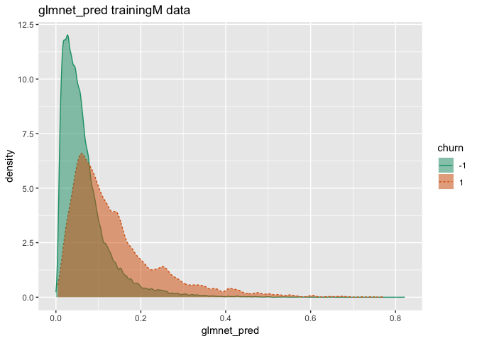
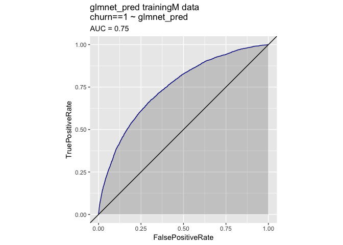
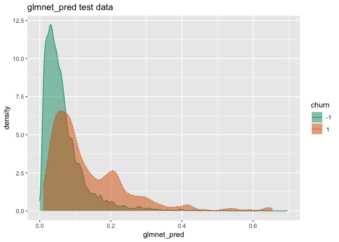
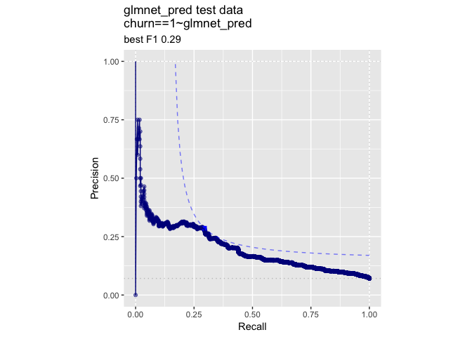

KDD2009vtreat
================
John Mount

KDD2009 example using the
[`CVRTSEncoder`](https://github.com/WinVector/CVRTSEncoder) `R` package.

``` r
date()
```

    ## [1] "Mon May 27 10:43:01 2019"

``` r
#load some libraries
library('vtreat')
library('WVPlots') 
```

    ## Registered S3 methods overwritten by 'ggplot2':
    ##   method         from 
    ##   [.quosures     rlang
    ##   c.quosures     rlang
    ##   print.quosures rlang

``` r
library('CVRTSEncoder')
library('sigr')
library('parallel')
library("glmnet")
```

    ## Loading required package: Matrix

    ## Loading required package: foreach

    ## Loaded glmnet 2.0-18

``` r
dir = "../../PracticalDataScienceWithR2nd/PDSwR2/KDD2009/"


d <- read.table(paste(dir, 'orange_small_train.data.gz', sep = "/"), 
   header = TRUE,
   sep = '\t',
   na.strings = c('NA', '')) 
                                                
churn <- read.table(paste(dir, 'orange_small_train_churn.labels.txt', sep = "/"),
   header = FALSE, sep = '\t')  
d$churn <- churn$V1 

set.seed(729375) 
rgroup <- base::sample(c('train', 'test'),   
   nrow(d), 
   prob = c(0.9, 0.1),
   replace = TRUE)
dTrain <- d[rgroup=='train', , drop = FALSE]
dTest <- d[rgroup == 'test', , drop = FALSE]
                                                
outcome <- 'churn' 
vars <- setdiff(colnames(dTrain), outcome)

                                                
rm(list=c('d', 'churn', 'rgroup'))  

set.seed(239525)

ncore <- parallel::detectCores()
(cl = parallel::makeCluster(ncore))
```

    ## socket cluster with 4 nodes on host 'localhost'

``` r
yName <- "churn"
yTarget <- 1

# prepare plotting frames
trainPlot = dTrain[, yName, drop=FALSE]
testPlot = dTest[, yName, drop=FALSE]

alpha = 0.5

date()
```

    ## [1] "Mon May 27 10:43:10 2019"

``` r
date()
```

    ## [1] "Mon May 27 10:43:10 2019"

``` r
# Run other models (with proper coding/training separation).
#
# This gets us back to AUC 0.74 range

customCoders = list('c.PiecewiseV.num' = vtreat::solve_piecewise,
                    'n.PiecewiseV.num' = vtreat::solve_piecewise,
                    'c.knearest.num' = vtreat::square_window,
                    'n.knearest.num' = vtreat::square_window)
cfe = mkCrossFrameCExperiment(dTrain,
                              vars,yName,yTarget,
                              customCoders=customCoders,
                              smFactor=2.0, 
                              parallelCluster=cl)
```

    ## [1] "vtreat 1.4.0 start initial treatment design Mon May 27 10:43:10 2019"
    ## [1] " start cross frame work Mon May 27 10:48:57 2019"
    ## [1] " vtreat::mkCrossFrameCExperiment done Mon May 27 10:51:48 2019"

``` r
treatmentsC = cfe$treatments
scoreFrame = treatmentsC$scoreFrame
table(scoreFrame$code)
```

    ## 
    ##       catB       catP      clean      isBAD   knearest        lev 
    ##         33         33        173        171          3        137 
    ## PiecewiseV 
    ##        166

``` r
selvars <- scoreFrame$varName[scoreFrame$sig<1/nrow(scoreFrame)]
treatedTrainM <- cfe$crossFrame[,c(yName,selvars),drop=FALSE]
treatedTrainM[[yName]] = treatedTrainM[[yName]]==yTarget

treatedTest = prepare(treatmentsC,
                      dTest,
                      pruneSig=NULL, 
                      varRestriction = selvars,
                      parallelCluster=cl)
treatedTest[[yName]] = treatedTest[[yName]]==yTarget


date()
```

    ## [1] "Mon May 27 10:51:49 2019"

``` r
date()
```

    ## [1] "Mon May 27 10:51:49 2019"

``` r
mname = 'glmnet_pred'
print(paste(mname,length(selvars)))
```

    ## [1] "glmnet_pred 359"

``` r
model <- 
  cv.glmnet(as.matrix(treatedTrainM[, selvars, drop = FALSE]),
                   treatedTrainM[[yName]]==yTarget,
                   alpha = alpha,
                   family = "binomial")
trainPlot[[mname]] = as.numeric(predict(
  model, 
  newx = as.matrix(treatedTrainM[, selvars, drop = FALSE]),
  type = 'response',
  s = "lambda.min"))
testPlot[[mname]] = as.numeric(predict(
  model,
  newx = as.matrix(treatedTest[, selvars, drop = FALSE]),
  type = 'response',
  s = "lambda.min"))
date()
```

    ## [1] "Mon May 27 10:59:21 2019"

``` r
calcAUC(testPlot[[mname]], testPlot[[yName]]==yTarget)
```

    ## [1] 0.735378

``` r
permTestAUC(testPlot, mname, yName, yTarget = yTarget)
```

    ## [1] "AUC test alt. hyp. AUC>AUC(permuted): (AUC=0.7354, s.d.=0.01568, p<1e-05)."

``` r
wrapChiSqTest(testPlot, mname, yName, yTarget = yTarget)
```

    ## [1] "Chi-Square Test summary: pseudo-R2=0.1015 (X2(1,N=4972)=258.6, p<1e-05)."

``` r
date()
```

    ## [1] "Mon May 27 10:59:21 2019"

``` r
t1 = paste(mname,'trainingM data')
print(DoubleDensityPlot(trainPlot, mname, yName, 
                        title=t1))
```

<!-- -->

``` r
print(ROCPlot(trainPlot, mname, yName, yTarget,
              title=t1))
```

<!-- -->

``` r
print(WVPlots::PRPlot(trainPlot, mname, yName, yTarget,
              title=t1))
```

<!-- -->

``` r
t2 = paste(mname,'test data')
print(DoubleDensityPlot(testPlot, mname, yName, 
                        title=t2))
```

<!-- -->

``` r
print(ROCPlot(testPlot, mname, yName, yTarget,
              title=t2))
```

<!-- -->

``` r
print(WVPlots::PRPlot(testPlot, mname, yName, yTarget,
              title=t2))
```

<!-- -->

``` r
print(date())
```

    ## [1] "Mon May 27 10:59:24 2019"

``` r
print("*****************************")
```

    ## [1] "*****************************"

``` r
date()
```

    ## [1] "Mon May 27 10:59:24 2019"

``` r
# enrich with CVRRS encoded variables
date()
```

    ## [1] "Mon May 27 10:59:26 2019"

``` r
# encode as in https://github.com/WinVector/CVRTSEncoder
is_cat_var <- vapply(
  vars,
  function(ci) {
    is.character(dTrain[[ci]]) || is.factor(dTrain[[ci]])
  }, logical(1))
categorical_cols <- vars[is_cat_var]
numeric_cols <- vars[!is_cat_var]

cross_enc <- estimate_residual_encoding_c(
  data = dTrain,
  avars = c(numeric_cols, categorical_cols),
  evars = categorical_cols,
  dep_var = yName,
  dep_target = yTarget,
  n_comp = 5,
  cl = cl
)
te_vars <- colnames(cross_enc$cross_frame)
vars <- c(numeric_cols, te_vars)
dTrain <- cbind(dTrain, cross_enc$cross_frame)
dTest <- cbind(dTest,prepare(cross_enc$coder, dTest))

date()
```

    ## [1] "Mon May 27 11:39:16 2019"

``` r
date()
```

    ## [1] "Mon May 27 11:39:16 2019"

``` r
# Run other models (with proper coding/training separation).

customCoders = list('c.PiecewiseV.num' = vtreat::solve_piecewise,
                    'n.PiecewiseV.num' = vtreat::solve_piecewise,
                    'c.knearest.num' = vtreat::square_window,
                    'n.knearest.num' = vtreat::square_window)
cfe = mkCrossFrameCExperiment(dTrain,
                              vars,yName,yTarget,
                              customCoders=customCoders,
                              smFactor=2.0, 
                              parallelCluster=cl)
```

    ## [1] "vtreat 1.4.0 start initial treatment design Mon May 27 11:39:16 2019"
    ## [1] " start cross frame work Mon May 27 11:44:46 2019"
    ## [1] " vtreat::mkCrossFrameCExperiment done Mon May 27 11:49:35 2019"

``` r
treatmentsC = cfe$treatments
scoreFrame = treatmentsC$scoreFrame
table(scoreFrame$code)
```

    ## 
    ##      clean      isBAD   knearest PiecewiseV 
    ##        178        171          8        171

``` r
selvars <- scoreFrame$varName[scoreFrame$sig<1/nrow(scoreFrame)]
treatedTrainM <- cfe$crossFrame[,c(yName,selvars),drop=FALSE]
treatedTrainM[[yName]] = treatedTrainM[[yName]]==yTarget

treatedTest = prepare(treatmentsC,
                      dTest,
                      pruneSig=NULL, 
                      varRestriction = selvars,
                      parallelCluster=cl)
treatedTest[[yName]] = treatedTest[[yName]]==yTarget

date()
```

    ## [1] "Mon May 27 11:49:35 2019"

``` r
date()
```

    ## [1] "Mon May 27 11:49:36 2019"

``` r
mname = 'glmnet_pred_CVRTS'
print(paste(mname,length(selvars)))
```

    ## [1] "glmnet_pred_CVRTS 256"

``` r
model <- cv.glmnet(as.matrix(treatedTrainM[, selvars, drop = FALSE]),
                   treatedTrainM[[yName]]==yTarget,
                   alpha = alpha,
                   family = "binomial")
trainPlot[[mname]] = as.numeric(predict(
  model, 
  newx = as.matrix(treatedTrainM[, selvars, drop = FALSE]),
  type = 'response',
  s = "lambda.min"))
testPlot[[mname]] = as.numeric(predict(
  model,
  newx = as.matrix(treatedTest[, selvars, drop = FALSE]),
  type = 'response',
  s = "lambda.min"))
date()
```

    ## [1] "Mon May 27 11:53:21 2019"

``` r
calcAUC(testPlot[[mname]], testPlot[[yName]]==yTarget)
```

    ## [1] 0.7100485

``` r
permTestAUC(testPlot, mname, yName, yTarget = yTarget)
```

    ## [1] "AUC test alt. hyp. AUC>AUC(permuted): (AUC=0.71, s.d.=0.01354, p<1e-05)."

``` r
wrapChiSqTest(testPlot, mname, yName, yTarget = yTarget)
```

    ## [1] "Chi-Square Test summary: pseudo-R2=0.07978 (X2(1,N=4972)=203.3, p<1e-05)."

``` r
date()
```

    ## [1] "Mon May 27 11:53:21 2019"

``` r
t1 = paste(mname,'trainingM data')
print(DoubleDensityPlot(trainPlot, mname, yName, 
                        title=t1))
```

<!-- -->

``` r
print(ROCPlot(trainPlot, mname, yName, yTarget,
              title=t1))
```

<!-- -->

``` r
print(WVPlots::PRPlot(trainPlot, mname, yName, yTarget,
              title=t1))
```

<!-- -->

``` r
t2 = paste(mname,'test data')
print(DoubleDensityPlot(testPlot, mname, yName, 
                        title=t2))
```

<!-- -->

``` r
print(ROCPlot(testPlot, mname, yName, yTarget,
              title=t2))
```

<!-- -->

``` r
print(WVPlots::PRPlot(testPlot, mname, yName, yTarget,
              title=t2))
```

<!-- -->

``` r
print(date())
```

    ## [1] "Mon May 27 11:53:25 2019"

``` r
print("*****************************")
```

    ## [1] "*****************************"

``` r
date()
```

    ## [1] "Mon May 27 11:53:25 2019"

``` r
WVPlots::ROCPlotPair(testPlot, 
                     "glmnet_pred", "glmnet_pred_CVRTS",
                     yName, yTarget, "ROC on test",
                     estimate_sig = TRUE,
                     parallelCluster = cl)
```

<!-- -->

``` r
if(!is.null(cl)) {
    parallel::stopCluster(cl)
    cl = NULL
}
```
